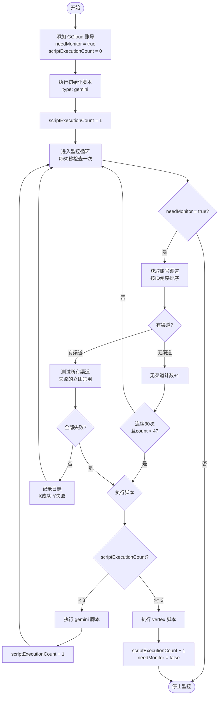

# GCloud 账号监控完整流程图

## 核心规则

1. **新账号**: scriptExecutionCount = 0，立即执行初始化脚本（gemini）
2. **监控周期**: 每60秒检查一次，needMonitor = true 才监控
3. **渠道测试**: 测试所有渠道，失败3次立即禁用
4. **脚本执行条件**:
   - 所有渠道测试失败
   - 连续30次无渠道且 scriptExecutionCount < 4
5. **脚本选择**:
   - scriptExecutionCount < 3: 执行 gemini
   - scriptExecutionCount >= 3: 执行 vertex（执行后禁用监控）